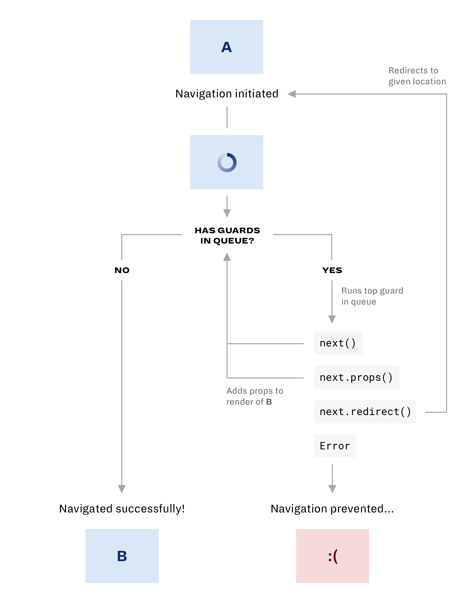

# Navigation lifecycle

With the addition of guard middleware, the navigation lifecycle has changed. It will now be as follows:

  

1. Start on _Page A_.

2. Navigation initiated. _The loading page is shown._

3. Check if there are guards are left in the queue.

   - If there are guards, continue to step 4.

   - If no guards remain, skip to step 5.

4. Run the top guard in the queue:

   - `next()`: Return to step 3.

   - `next.props()`: Add the props to the render of _Page B_, and return to step 3.

   - `next.redirect()`: Redirect to given location, and restart at step 1.

   - `Error`: Navigation has been prevented. _The error page is shown._

5. Navigation was successful! _Page B is shown._
